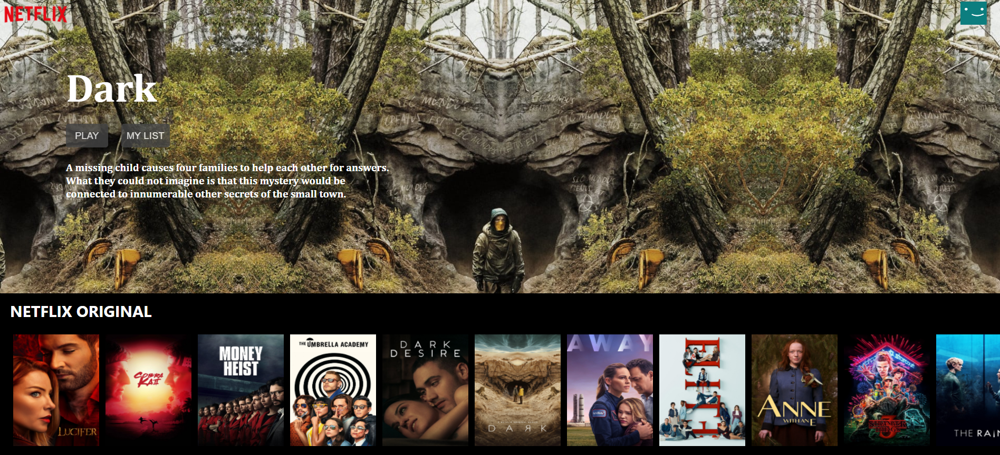
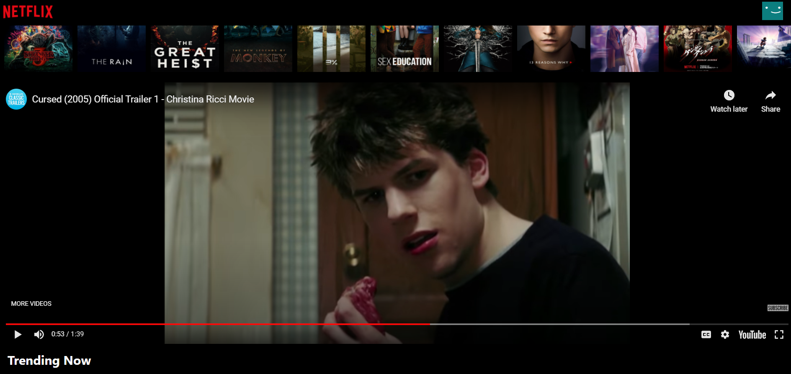

# This project is Prototype of Netflix i.e netflix-clone .That is used to watch the movie-trailer.

# Tool Used

1.Material-UI  
2.react-youtube  
3.movie-trailer  
4.get API_KEY from TMDb

## Available Scripts

In the project directory, you can run:

### `npm start`

Runs the app in the development mode. 
Open [http://localhost:3000](http://localhost:3000) to view it in the browser.

The page will reload if you make edits. 
You will also see any lint errors in the console.

# ScreenShots

